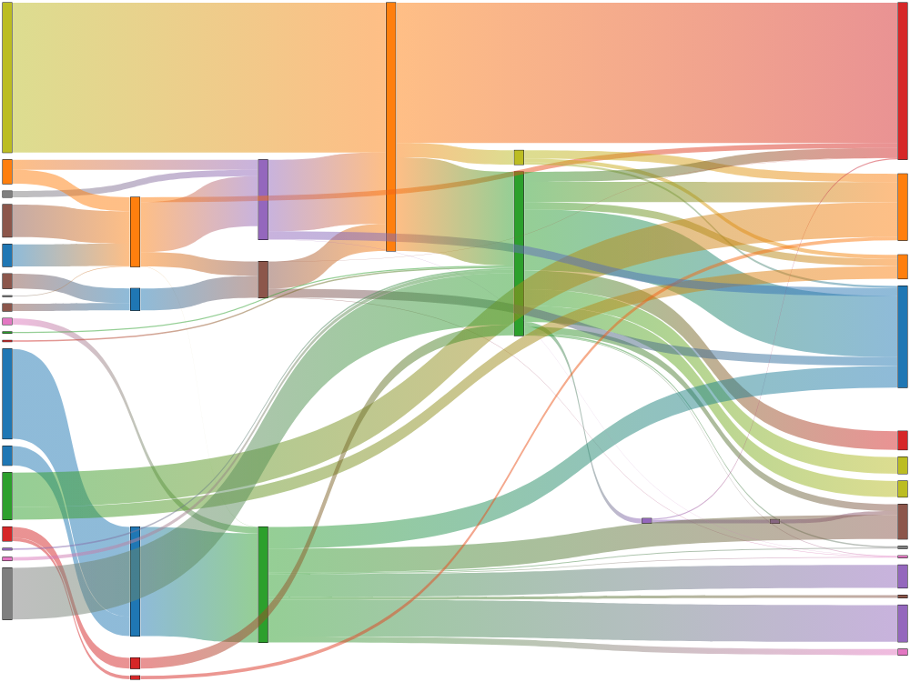

# @hedgehoglab/chartjs-chart-sankey

[](https://www.npmjs.com/package/@hedgehoglab/chartjs-chart-sankey)
[](https://github.com/hedgehoglab-engineering/chartjs-chart-sankey/releases/latest)


[Chart.js](https://www.chartjs.org/) **v3.3+, v4+** module that adds a sankey chart type, drawing flows between named nodes as directional bands whose width is proportional to the flow value — useful for visualizing energy transfers, budgets, funnels, and other flow-style data, for anyone already charting with Chart.js.

## hedgehog lab fork

This is hedgehog lab's fork of [kurkle/chartjs-chart-sankey](https://github.com/kurkle/chartjs-chart-sankey),
published as `@hedgehoglab/chartjs-chart-sankey`. It exists so a small set of behavioural customizations we
rely on internally live in source — mergeable with upstream via git — instead of a `patch-package` diff
against a compiled `dist/` bundle, which had to be hand-regenerated every time upstream cut a new release.

**What's different from upstream** (all in `src/`):

- `flow.ts` — flows are drawn with no stroke/border (`setStyle`/`drawFlowPath` no longer set
  `strokeStyle`/`lineWidth` or call `ctx.stroke()`).
- `flow.ts` — in `from`/`to` colour mode, `colorFrom`/`colorTo` are used as-is instead of having the
  dataset's `alpha` option re-applied on top, so colours that already carry their own alpha (e.g. an
  `rgba(...)` string built upstream of Chart.js) aren't overridden. `applyAlpha` also only touches a colour
  when an `alpha` value is actually given.
- `controller.ts` — `SankeyController#_nodes` and `#_drawLabels` are public instead of private, so
  consuming code can read node layout data and override label drawing (e.g. to suppress labels) without
  fighting TypeScript.

We deliberately did **not** port the old patch's hover/active colour-switching — upstream already resolves
`hoverColorFrom`/`hoverColorTo` automatically for an active flow via Chart.js's own `hover`-prefixed option
resolution (`DatasetController#_resolveElementOptions`), so it wasn't needed against this version.

Tests for all three behaviours live in `src/flow.test.ts` (search for "hedgehog lab").

**Keeping this in sync with upstream:** the intent is for future upstream releases to be pulled in via
`git fetch upstream && git merge upstream/main`, then re-checking that the diffs above still apply cleanly
(conflicts will usually land in `src/flow.ts`/`src/controller.ts`). We'd like this to eventually be
automated (a bot or LLM-driven workflow triggered off new upstream releases that merges and re-applies
these customizations) — the tests above exist specifically so that process has something to verify
against — but that automation doesn't exist yet; for now, upgrades are a manual `git merge`.

**Publishing** works exactly as it does upstream: pushing to `main` runs CI, which runs `semantic-release`
based on conventional-commit messages — that's what bumps the version, publishes to npm, and cuts the
GitHub release. There's no manual `npm publish` step.

## Example



## Installation

```bash
npm install @hedgehoglab/chartjs-chart-sankey chart.js
```

Or via CDN:

```html
<script src="https://cdn.jsdelivr.net/npm/chart.js"></script>
<script src="https://cdn.jsdelivr.net/npm/@hedgehoglab/chartjs-chart-sankey"></script>
```

## Quickstart

```js
import { Chart, LinearScale } from 'chart.js';
import { Flow, SankeyController } from '@hedgehoglab/chartjs-chart-sankey';

Chart.register(LinearScale, SankeyController, Flow);

new Chart(document.getElementById('chart'), {
  type: 'sankey',
  data: {
    datasets: [
      {
        label: 'My sankey',
        data: [
          {from: 'a', to: 'b', flow: 10},
          {from: 'a', to: 'c', flow: 5},
          {from: 'b', to: 'd', flow: 6},
          {from: 'c', to: 'd', flow: 4},
        ],
      },
    ],
  },
});
```

## Documentation

Beyond the fork-specific behaviour documented above, the dataset/options reference is unchanged from
upstream — see [kurkle/chartjs-chart-sankey's docs](https://chartjs-chart-sankey.pages.dev/) for the full
API. We don't maintain a separate hosted docs site for this fork.

## Development

You first need to install node dependencies (requires [Node.js](https://nodejs.org/)):

```bash
> npm install
```

The following commands will then be available from the repository root:

```bash
> npm run build        // build dist files
> npm run autobuild     // build and watch for changes
> npm test              // run all tests
> npm run lint          // perform code linting
```

## License

chartjs-chart-sankey is available under the [MIT license](https://opensource.org/licenses/MIT).
